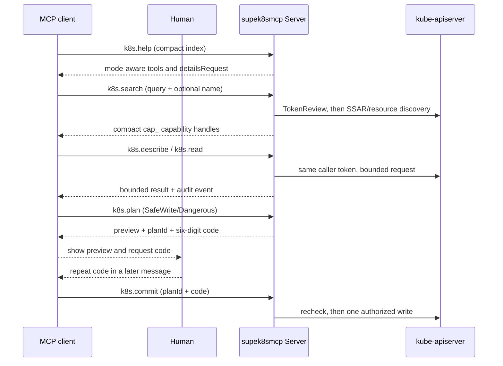
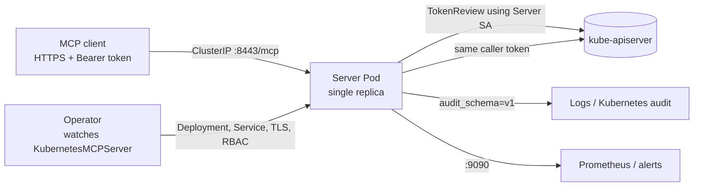

# supek8smcp

<p align="center"></p>

<p align="center"><strong>A caller-preserving Kubernetes MCP gateway.</strong><br>
Turn a namespaced custom resource into a single-replica, HTTPS Streamable HTTP MCP endpoint while every Kubernetes request keeps the caller's own identity and RBAC.</p>

[English](README.md) | [简体中文](README.zh-CN.md)

[](https://github.com/samuelsupe/supek8smcp/actions/workflows/ci.yml)
[](https://github.com/samuelsupe/supek8smcp/actions/workflows/release.yml)
[](https://github.com/samuelsupe/supek8smcp/pkgs/container/supek8smcp)
[](go.mod)

## What's new in v0.5.1

This release improves availability under concurrency and reduces repeated discovery and authorization work:

- Multi-platform container builds now use BuildKit target values, so the ARM64 image contains an ARM64 executable.
- Search filters only explicit policy/RBAC denials and propagates authorization service failures and cancellation. Identical reviews are reused within one search; commits always reauthorize.
- Catalog refresh supports request cancellation and a five-second failure backoff. OpenAPI caching is isolated by reviewed identity and token hash, with a five-minute TTL and bounded capacity.
- A pre-authentication global rate limit, per-identity concurrency limits, and a streaming cap reserve capacity for ordinary requests. A busy stream gate does not consume a remote operation plan.
- New `spec.resources` settings align Server pod CPU/memory with request budgets. New metrics cover stage latency, caches, concurrency, and plan storage.

**Upgrade notes:** update the CRD before upgrading the Helm release. `maxConcurrent: 1` rejects watch, followed logs, and exec/attach with `stream_disabled`; configure at least `2` to use these operations. Higher concurrency or input/output budgets may require increasing `spec.resources.limits.memory`; defaults still fit `256Mi`. See the [deployment guide](docs/deployment.md) for budget rules and the [changelog](CHANGELOG.md#051---2026-09-05) for all changes.

## v0.5.1 downloads

- [Linux x64 (amd64) archive](https://github.com/SamuelSupe/supek8smcp/releases/download/v0.5.1/supek8smcp_0.5.1_linux_amd64.tar.gz)
- [Linux ARM64 archive](https://github.com/SamuelSupe/supek8smcp/releases/download/v0.5.1/supek8smcp_0.5.1_linux_arm64.tar.gz)
- [SHA-256 checksums](https://github.com/SamuelSupe/supek8smcp/releases/download/v0.5.1/checksums.txt)

Install or upgrade the Operator chart directly from the GitHub Release:

```bash
kubectl apply -f https://raw.githubusercontent.com/SamuelSupe/supek8smcp/v0.5.1/config/crd/bases/mcp.supek8smcp.io_kubernetesmcpservers.yaml
helm upgrade --install supek8smcp https://github.com/SamuelSupe/supek8smcp/releases/download/v0.5.1/supek8smcp-0.5.1.tgz \
  --namespace supek8smcp-system --create-namespace
```

`supek8smcp` watches `mcp.supek8smcp.io/v1alpha1/KubernetesMCPServer` resources (also called `kmcp`). Each resource creates one HTTPS MCP Server, a `ClusterIP` Service, TLS material, and the minimum TokenReview binding needed by that Server. The Server validates the client's Kubernetes Bearer token, then uses the same token for the Kubernetes API: the endpoint cannot grant more Kubernetes access than the caller already has.

## What it provides

- A progressively disclosed MCP surface: start with `k8s.help`, search for a compact opaque `cap_` capability handle, inspect or read only the selected resource, and use the explicit plan/commit boundary for writes.
- Three modes with conservative defaults and independent scope, policy, timeout, byte, list, concurrency, and per-identity rate budgets.
- Compact list/watch summaries by default, name-scoped list/watch selectors, resumable watch resourceVersions and bookmarks, recursive omission of annotations and managed fields, credential-like annotation redaction, bounded schema/log/exec output, structured errors and audit events, Prometheus metrics, and optional alerts.
- Operator-managed shared CA and automatic serving-leaf rotation, or a validated same-namespace `kubernetes.io/tls` Secret.

## Modes at a glance

| Mode | Available tools | Guardrails |
| --- | --- | --- |
| `ReadOnly` | `k8s.help`, `k8s.search`, `k8s.describe`, `k8s.read` | Reads only; pod logs require one-shot `follow=false`; no writes, exec, or attach. |
| `SafeWrite` | Read-only tools plus `k8s.plan`, `k8s.commit` | Every write requires a two-minute one-time plan and the six-digit code repeated by a human in a later user message; logs remain one-shot. |
| `Dangerous` | SafeWrite plus streaming logs and bounded non-interactive `exec`/`attach` | The same human-code commit gate applies; `streamTimeout`, `execTimeout`, byte, list, and concurrency limits remain; no TTY. |

CR `scope` and `policy` define an upper bound. The request Bearer token's Kubernetes RBAC is always checked as a second, independent boundary; effective permission is the intersection.

The confirmation code is visible to the model. It enforces a two-turn, human-in-the-loop convention for compliant clients, but it cannot prove who supplied the code or resist a malicious model/prompt injection. Use an external approval gateway when verified separation of duties is required.

## Progressive MCP workflow



`k8s.help` is local static data, but requests still pass authentication, rate limiting, and audit. `k8s.search` supports exact kind, resource, API group, version, and action filters. `k8s.describe` resolves exact `fieldPath` values through `$ref`, `allOf`, `oneOf`, and `anyOf` before expansion and caps one expansion at 10,000 nodes. List calls page at most eight upstream objects and preserve Kubernetes `continue` tokens. Non-watch delegated, discovery, and OpenAPI responses are capped at 8 MiB.

### Compact read output

`k8s.read` list and watch actions default to `outputMode: summary`; get defaults to `full`. Every mode recursively omits `metadata.annotations` and `metadata.managedFields` unless `omitAnnotations: false` or `omitManagedFields: false` is explicit. Credential-like annotation keys or embedded assignments remain redacted when annotations are included. For list/watch, pass `name` when a Role uses `resourceNames`; the Server adds an exact `metadata.name` selector and rejects a conflicting selector. Pass a returned `resourceVersion` to resume a watch; the result carries the latest resource version and bounded bookmark/error events. Pod logs and Dangerous remote actions resolve the default-container annotation when `container` is omitted (which requires Pod `get` permission), and continuous logs remain bounded even when a line is longer than the output budget. Use `table` for the smallest repeated-row representation, `full` only when the whole object is needed, or `fieldPaths` to project the same object-relative paths from one object or every list item:

```json
{
  "capabilityId": "cap_example",
  "namespace": "platform",
  "outputMode": "summary",
  "fieldPaths": ["metadata.name", "status.phase", "status.reason"]
}
```

Tool and HTTP failures use `{ "code": "scope_denied", "message": "...", "retryable": false }`. An unknown process-local capability handle is not retryable as-is: call `k8s.search` again to obtain a current handle.

## Architecture



## Secure quickstart

Create a dedicated endpoint namespace first. Anyone who can create a Pod there may be able to mount TLS material or the Server ServiceAccount, so do not share this namespace with ordinary tenants or grant them Pod/Deployment creation.

```bash
make install
make deploy IMG=ghcr.io/your-org/supek8smcp:0.5.1
kubectl create namespace supek8smcp-servers
```

Apply a least-privilege, read-only endpoint (the full example is in [`docs/deployment.md`](docs/deployment.md)):

```yaml
apiVersion: mcp.supek8smcp.io/v1alpha1
kind: KubernetesMCPServer
metadata:
  name: team-readonly
  namespace: supek8smcp-servers
spec:
  mode: ReadOnly
  scope:
    namespaces: [platform]
    allowClusterScopedRead: false
  policy:
    sensitiveReads: Redact
  tls: {}
  networkPolicy:
    enabled: true
    allowedNamespaceSelector:
      matchLabels:
        kubernetes.io/metadata.name: platform
```

```bash
kubectl apply -f kubernetesmcpserver.yaml
kubectl -n supek8smcp-servers get kmcp team-readonly -o wide
kubectl -n supek8smcp-servers get svc -l app.kubernetes.io/instance=team-readonly
```

Use `status.endpoint` and the CA from `status.caConfigMapName`; send a short-lived ServiceAccount token as `Authorization: Bearer ...`. Keep TLS verification enabled, never put a token in a URL, and expose the `ClusterIP` only through a controlled TLS-aware gateway when an external client is required.

## Install and configure

Build and publish an immutable image, then install the CRD and Operator:

```bash
export IMG=registry.example.com/platform/supek8smcp:0.5.1
make docker-build IMG="$IMG"
docker push "$IMG"
make install
make deploy IMG="$IMG"
```

`spec.mode`, `spec.scope`, `spec.policy`, `spec.limits`, `spec.tls`, and `spec.networkPolicy` are the operator-facing contract. Review the generated `<name>-config` ConfigMap and `status.conditions` (`Ready`, `TLSReady`, and `AuthReady`) after every change. See [`docs/deployment.md`](docs/deployment.md) for TLS choices, RBAC, upgrades, monitoring, and troubleshooting.

## Observability and security

The Server writes `audit_schema=v1` JSON events without tokens, plan IDs, confirmation codes, resource bodies, patches, commands, stdin, logs, or responses. Metrics are available on `:9090/metrics`, including authentication attempts, rate-limit rejections, audit events, tool results, and tool duration. Optional Prometheus resources live under [`config/monitoring`](config/monitoring).

Read the [security model](docs/security.md) before enabling `SafeWrite` or `Dangerous`. It documents namespace trust, TokenReview/RBAC, Origin rejection, self-protection of operator-managed resources, SafeWrite payload checks, plan budgets, TLS rotation, NetworkPolicy, and incident handling.

## Development and release

```bash
make fmt
make vet
make test
make build
make docker-build IMG=ghcr.io/your-org/supek8smcp:0.5.1
```

Use `make manifests` when API types change; review generated YAML rather than editing it by hand. Release images should use immutable tags or digests and be published through the repository's release automation. See [`CHANGELOG.md`](CHANGELOG.md), [`CONTRIBUTING.md`](CONTRIBUTING.md), and [`SECURITY.md`](SECURITY.md) before opening a change or reporting a vulnerability.

## Deliberate boundaries

The first release does not provide OAuth, port-forward, `cp`, proxy, evict, drain, TTY, multi-cluster routing, JSON-RPC batch, or multi-replica Server deployments. `Dangerous` is not an administrator shell: exec/attach is non-interactive and bounded. A dedicated endpoint namespace, TLS verification, short-lived caller tokens, and least-privilege Kubernetes RBAC remain deployment requirements even when the CR policy is permissive.
