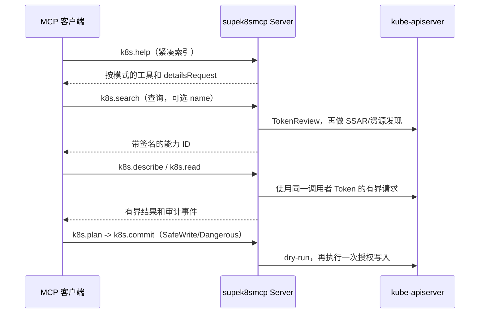
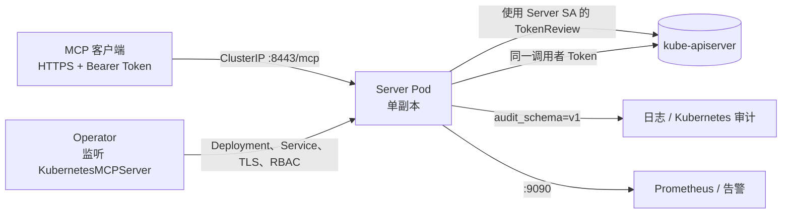

# supek8smcp

<p align="center"></p>

<p align="center"><strong>保留调用者身份的 Kubernetes MCP 网关。</strong><br>
将 namespaced 自定义资源变成单副本 HTTPS Streamable HTTP MCP 端点，同时保留调用者自己的身份和 Kubernetes RBAC。</p>

[English](README.md) | [简体中文](README.zh-CN.md)

[](https://github.com/samuelsupe/supek8smcp/actions/workflows/ci.yml)
[](https://github.com/samuelsupe/supek8smcp/actions/workflows/release.yml)
[](https://github.com/samuelsupe/supek8smcp/pkgs/container/supek8smcp)
[](go.mod)

`supek8smcp` 监听 `mcp.supek8smcp.io/v1alpha1/KubernetesMCPServer` 资源（简称 `kmcp`）。每个资源创建一个 HTTPS MCP Server、`ClusterIP` Service、TLS 材料，以及该 Server 所需的最小 TokenReview 绑定。Server 校验客户端的 Kubernetes Bearer Token，再使用同一个 Token 访问 Kubernetes API；端点不能授予调用者原本没有的 Kubernetes 权限。

## 提供的能力

- 渐进式 MCP 工具面：先调用 `k8s.help`，再搜索带签名的能力 ID，只检查或读取选中的资源，写入必须经过明确的 plan/commit 边界。
- 三种模式，以及独立的 scope、policy、超时、字节、列表、并发和按身份限流预算。
- Secret 默认脱敏、有界 schema 展开、有界日志与 exec/attach、结构化安全审计事件、Prometheus 指标和可选告警。
- Operator 自管共享 CA 并自动轮换服务端叶子证书，或使用经校验的同命名空间 `kubernetes.io/tls` Secret。

## 模式对比

| 模式 | 可用工具 | 保护边界 |
| --- | --- | --- |
| `ReadOnly` | `k8s.help`、`k8s.search`、`k8s.describe`、`k8s.read` | 只读；Pod 日志必须一次性 `follow=false`；不允许写入、exec 或 attach。 |
| `SafeWrite` | 只读工具，以及 `k8s.plan`、`k8s.commit` | 所有持久写入都要先 plan，计划两分钟后过期且只能提交一次；日志仍为一次性读取。 |
| `Dangerous` | SafeWrite 全部工具，以及持续日志和有界非交互 `exec`/`attach` | 仍受 `streamTimeout`、`execTimeout`、字节、列表和并发限制；不提供 TTY。 |

CR 的 `scope` 和 `policy` 是能力上限。请求 Bearer Token 的 Kubernetes RBAC 始终作为第二层独立边界检查；最终权限是两者交集。

## 渐进式 MCP 流程



`k8s.help` 使用本地静态数据，但请求仍需通过认证、限流和审计。`k8s.describe` 会先定位精确 `fieldPath`，再展开 `$ref` schema，单次展开最多 10,000 个节点。列表请求每次最多向上游读取 8 个对象并保留 Kubernetes `continue` token。非 watch 的委派、discovery 和 OpenAPI 响应上限为 8 MiB。

## 架构



## 安全快速开始

先创建专用端点命名空间。任何能在其中创建 Pod 的主体都可能挂载 TLS 材料或 Server ServiceAccount，因此不要与普通租户共用，也不要授予普通租户创建 Pod/Deployment 的权限。

```bash
make install
make deploy IMG=ghcr.io/your-org/supek8smcp:0.1.0
kubectl create namespace supek8smcp-servers
```

应用最小权限的只读端点（完整示例见 [`docs/deployment.zh-CN.md`](docs/deployment.zh-CN.md)）：

```yaml
apiVersion: mcp.supek8smcp.io/v1alpha1
kind: KubernetesMCPServer
metadata:
  name: team-readonly
  namespace: supek8smcp-servers
spec:
  mode: ReadOnly
  scope:
    namespaces: [platform]
    allowClusterScopedRead: false
  policy:
    sensitiveReads: Redact
  tls: {}
  networkPolicy:
    enabled: true
    allowedNamespaceSelector:
      matchLabels:
        kubernetes.io/metadata.name: platform
```

```bash
kubectl apply -f kubernetesmcpserver.yaml
kubectl -n supek8smcp-servers get kmcp team-readonly -o wide
kubectl -n supek8smcp-servers get svc -l app.kubernetes.io/instance=team-readonly
```

使用 `status.endpoint` 和 `status.caConfigMapName` 对应的 CA；将短期 ServiceAccount Token 放在 `Authorization: Bearer ...` 中。保持 TLS 校验开启，不要把 Token 放进 URL；需要外部客户端时，只能通过受控且支持 TLS 的网关暴露 `ClusterIP`。

## 安装与配置

构建并发布不可变镜像，然后安装 CRD 和 Operator：

```bash
export IMG=registry.example.com/platform/supek8smcp:0.1.0
make docker-build IMG="$IMG"
docker push "$IMG"
make install
make deploy IMG="$IMG"
```

`spec.mode`、`spec.scope`、`spec.policy`、`spec.limits`、`spec.tls` 和 `spec.networkPolicy` 是 Operator 配置契约。每次变更后检查生成的 `<name>-config` ConfigMap 和 `status.conditions`（`Ready`、`TLSReady`、`AuthReady`）。TLS、RBAC、升级、监控和排障见 [`docs/deployment.zh-CN.md`](docs/deployment.zh-CN.md)。

## 可观测性与安全

Server 输出 `audit_schema=v1` JSON 事件，但不包含 Token、计划、资源正文、patch、命令、stdin、日志或响应。`:9090/metrics` 提供认证尝试、限流拒绝、审计事件、工具结果和工具耗时等指标。可选 Prometheus 资源位于 [`config/monitoring`](config/monitoring)。

启用 `SafeWrite` 或 `Dangerous` 前请阅读[安全模型](docs/security.zh-CN.md)。其中说明命名空间信任、TokenReview/RBAC、Origin 拒绝、Operator 管理资源自保护、SafeWrite payload 检查、计划预算、TLS 轮换、NetworkPolicy 和事件处理。

## 开发与发布

```bash
make fmt
make vet
make test
make build
make docker-build IMG=ghcr.io/your-org/supek8smcp:0.1.0
```

API 类型变更时使用 `make manifests`，审查生成的 YAML，不要手工修改。发布镜像应使用不可变 tag 或 digest，并通过仓库的 release 自动化发布。提交改动或报告漏洞前请阅读 [`CHANGELOG.md`](CHANGELOG.md)、[`CONTRIBUTING.md`](CONTRIBUTING.md) 和 [`SECURITY.md`](SECURITY.md)。

## 明确边界

第一版不提供 OAuth、port-forward、`cp`、proxy、evict、drain、TTY、多集群路由、JSON-RPC batch 或多副本 Server。`Dangerous` 不是管理员 shell：exec/attach 必须非交互且有界。无论 CR policy 多么宽松，专用端点命名空间、TLS 校验、短期调用者 Token 和最小 Kubernetes RBAC 都仍是部署要求。
