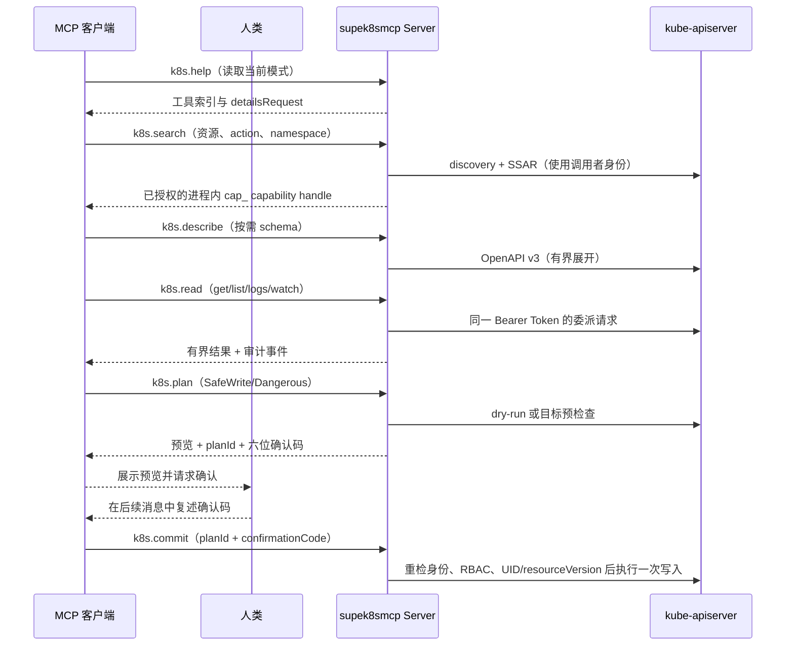
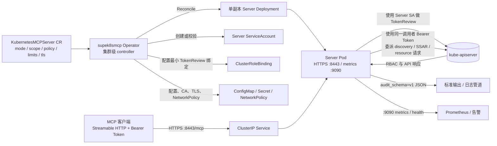

# supek8smcp：把 Kubernetes 权限边界带进 MCP 工作流

> 用 CRD 声明边界，用 Operator 交付端点，用调用者 Token 保留 RBAC，用 plan/commit 守住变更。

当 Kubernetes 操作通过 AI 助手或其他 MCP 客户端完成时，真正难的通常不是“能不能调用 API”，而是如何同时满足三件事：让客户端能够发现合适的资源和动作；让每个请求遵守团队为端点设定的边界；让 Kubernetes 继续以真实调用者的身份执行 RBAC 检查。

supek8smcp（Kubernetes MCP Server）提供的正是这一层边界：把一个 namespaced 的 `KubernetesMCPServer` 自定义资源，调谐为一个单副本、HTTPS Streamable HTTP MCP 端点。客户端发送短期 Kubernetes Bearer Token，Server 先通过 TokenReview 识别调用者，再使用同一个 Token 访问 kube-apiserver。CR 的 `scope`、`policy` 与调用者自己的 Kubernetes RBAC 同时生效，最终权限是两者的交集，而不是由 MCP 端点代替调用者获得一套更大的权限。

## 为什么平台团队需要一个 Kubernetes MCP 网关

传统的 Kubernetes 自动化往往把权限、脚本和执行入口绑定在某个机器人 ServiceAccount 上。这样的入口容易变成“拥有一组宽权限的远程 shell”：调用者是谁、为什么执行、是否经过确认，往往需要在入口之外另行补齐。

supek8smcp 将这些控制点放到同一个 Kubernetes 原生对象和运行时路径中：

- 以 namespaced CR 为交付单元，为不同团队或工作负载域创建独立端点。
- 以 `scope` 和 `policy.rules` 给端点设置能力上限，再用 TokenReview、SelfSubjectAccessReview（SSAR）和实际 API 请求保留调用者的身份与 RBAC。
- 以渐进式工具面降低发现成本和上下文负担：先看帮助，再搜索已授权能力，按需查看 schema，最后读取或计划变更。
- 以请求、响应、并发、列表、流和按身份限流预算约束资源消耗。
- 以结构化审计、Prometheus 指标、TLS 和 NetworkPolicy 把它放进平台的日常运维体系。

这不是把 Kubernetes 变成“对模型开放的管理员终端”，而是把 Kubernetes 已有的权限和运维边界显式带入 MCP 工作流。

## 三种模式：从观察到受控变更

每个 `KubernetesMCPServer` 选择一个访问模式。模式决定工具是否出现，以及哪些动作能进入后续的策略和 RBAC 检查。

| 模式 | 能力 | 适合场景 | 关键限制 |
| --- | --- | --- | --- |
| `ReadOnly` | `k8s.help`、`k8s.search`、`k8s.describe`、`k8s.read` | 生产巡检、故障定位、只读问答 | 不能写入、exec 或 attach；Pod 日志只能一次性读取 |
| `SafeWrite` | 只读工具，加上 `k8s.plan`、`k8s.commit` | 受限的配置、部署和扩缩容变更 | 每次变更都要经过 plan/commit 和六位确认码；删除、exec、attach 等危险动作被拒绝 |
| `Dangerous` | SafeWrite 全部能力，加上持续日志和有界 exec/attach | 明确授权的深度排障 | 仍需人工确认；exec/attach 非交互、无 TTY，并受超时、输出、并发限制 |

留空 `policy.rules` 时，Server 使用当前模式的保守默认能力；配置规则也不能绕过调用者的 Kubernetes RBAC。`allowClusterScopedWrite: true` 只有在 `Dangerous` 模式下才是合法配置。无论使用哪种模式，Server 自身的 CR、配置、TLS、Deployment、ServiceAccount、NetworkPolicy、TokenReview RBAC，以及 Operator 管理的资源都会被保护，不能通过该 Server 修改。

## 核心能力：一条渐进式 MCP 工作流

### 1. `k8s.help`：先加载当前模式的工具手册

`k8s.help` 不直接访问 Kubernetes API。无参数调用返回紧凑索引和当前模式下每个工具的可用性；再传入一个精确工具名，才加载该工具的输入、步骤、返回值和安全提示。

它是静态的本地帮助数据，但请求仍然要通过 Bearer 认证、全局并发控制、按身份限流和审计。这样，帮助信息也会遵守与其他 MCP 请求一致的入口治理。

### 2. `k8s.search`：搜索“策略允许且调用者有权使用”的能力

Server 使用 Kubernetes discovery 枚举 API 资源和子资源，再把它们映射为能力。例如，普通 Kubernetes verb 会形成 `get`、`list`、`watch`、`create`、`update`、`patch`、`delete` 等能力，另外还会暴露 `logs`、`scale`、`restart`、`apply`、`exec`、`attach` 等逻辑 action。

搜索结果不是一个未经筛选的全局 API 目录。Server 会依次考虑端点模式、命名空间范围、`policy.rules` 和调用者的 SSAR/RBAC，并返回进程内的不透明 `cap_` capability handle。后续的 `describe`、`read`、`plan` 都必须携带这个 handle。搜索结果支持 `nextCursor` 分页；当 Role 使用 `resourceNames` 时，还应在搜索中传入具体 `name`，使 SSAR 按目标对象检查权限。

能力目录默认在 Server 进程内缓存约 5 分钟。刷新由单个进程内加载串行化，完整旧目录可在 discovery 暂时失败时继续使用，成功刷新期间已有 handle 仍可解码；能力 handle 与运行中的 Server 实例绑定，重启后会失效。更稳妥的客户端行为是每次工作流先搜索，再把返回的 handle 原样传给下一步工具。

### 3. `k8s.describe`：按需读取有界 OpenAPI schema

当客户端需要构造 patch 或 Kubernetes 对象时，可对搜索得到的能力请求 OpenAPI v3 schema。调用可以先使用较浅的 depth，再用 `fieldPath`（例如 `spec.template.spec`）定位到需要的片段。

实现会先定位字段，再展开 `$ref`；depth 被限制在 1 到 6，单次展开最多 10,000 个节点，超出预算会显式返回截断标记。它只做 schema 描述，不读取资源实例，也不修改对象。

### 4. `k8s.read`：读取、列表、watch 和 Pod 日志

`k8s.read` 支持已授权的 `get`、`list`、`watch` 和 `logs`：

- `get` 要求明确的对象名；`list` 支持 label selector、field selector 和 Kubernetes `continue` token。
- 每次向 kube-apiserver 请求的列表页最多读取 8 个对象，即使 CR 的 `maxListItems` 更大；客户端应沿着返回的 `cursor` 逐页读取。
- watch 受 `streamTimeout`、`maxListItems` 和 `maxOutputBytes` 共同约束，并可通过 MCP progress notification 报告进度；传入 `name` 会附加精确的 `metadata.name` field selector，传入返回的 `resourceVersion` 可续传，结果包含最新版本以及 bookmark/error 事件诊断。
- Pod 日志在三种模式都支持 `follow=false` 的一次性读取；`follow=true` 仅在 `Dangerous` 中可用，并仍受流超时、行数和输出字节限制。
- 省略 Pod `container` 时，Server 使用 `kubectl.kubernetes.io/default-container` 注解或第一个常规容器，并要求 Pod `get` 权限；超长连续日志行会被截断而不会突破输出预算，exec/attach 失败会保留有界 stdout/stderr 和可用的退出码。

Secret 的读取遵循 `policy.sensitiveReads`。默认 `Redact` 会隐藏 Secret 的 `data`、`stringData`、`binaryData` 以及 annotations；也可以显式 `Deny` 或 `Allow`。非 watch 的委派 Kubernetes、discovery 和 OpenAPI 响应有 8 MiB 硬上限，MCP 输入和输出也有独立的 `maxInputBytes`、`maxOutputBytes` 预算。

### 5. `k8s.plan` / `k8s.commit`：把写操作变成显式边界

写工具不会直接从自然语言跳到 Kubernetes mutation。客户端需要先使用 `k8s.search` 找到写能力，再调用 `k8s.plan`：

1. Server 检查 capability、模式、scope、policy 和调用者 SSAR/RBAC。
2. 对 Kubernetes 对象执行 dry-run 或读取目标对象，形成变更预览；远程 exec/attach 会明确标注它无法进行 server-side dry-run。
3. Server 返回一次性 `planId`、过期时间、预览、警告和六位确认码。
4. 客户端把预览和确认码展示给人类，并停止调用写工具。
5. 只有人类在后续用户消息中复述该码，客户端才可在两分钟内携带同一身份调用 `k8s.commit`。

`commit` 消费计划后，会再次检查 Server 配置 generation、模式和 RBAC，并比较目标对象的 UID 与 resourceVersion。对象在 plan 后发生变化时，旧计划会冲突失败，需要重新搜索并创建计划。计划是一次性的；确认码连续五次错误会使计划失效。`SafeWrite` 还会比较变更前对象与 dry-run 后对象，拒绝放宽既有的非 root、seccomp、AppArmor、只读根文件系统、ServiceAccount 等安全控制，并限制 Service 暴露方式和工作负载安全字段。

这个确认码机制落实的是“展示预览、等待后续人类确认”的两轮协议，但确认码对模型本身可见，不能证明码一定由人类提供，也不能抵抗恶意模型或 Prompt Injection。若组织要求可验证的职责分离，应在 MCP 端点之外接入外部审批网关。

## 典型工作流

以平台团队为例，同一个端点可以把排障和变更分成两条明确路径：



这条路径适合拆成平台产品中的两个入口：默认将生产端点设置为 `ReadOnly`，用于“发生了什么”的诊断；对需要变更的命名空间单独创建 `SafeWrite` 端点，先以明确的 `policy.rules` 限定 ConfigMap、Service、Deployment 等资源。只有需要持续日志或非交互容器调试时，才评估 `Dangerous`，并继续使用最小 RBAC、严格限额和外部审批。

## 系统架构：Operator 管生命周期，Server 保留调用者身份

`KubernetesMCPServer` 是 namespaced 资源，但 Operator 是集群级控制器。每个 CR 对应一个单副本 Server Deployment、一个 `ClusterIP` Service、Server ServiceAccount、配置/CA ConfigMap、TLS Secret，以及按该 CR 绑定的 TokenReview ClusterRoleBinding。Operator 会校验固定的 `supek8smcp-tokenreviewer` ClusterRole 只允许 `authentication.k8s.io/tokenreviews.create`，不会代持客户端 Bearer Token。



Server 的 MCP 入口在 `:8443/mcp`，metrics 和 health 在 `:9090`。HTTPS 最低使用 TLS 1.2；带浏览器 `Origin` 的请求会被拒绝。Server 的 `/readyz` 会用自身 Kubernetes 凭据执行 TokenReview；TokenReview 权限或认证后端不可用时返回可重试的 `tokenreview_unavailable`，避免把无法验证调用者的 Pod 标记为 ready。Operator 默认创建入站 NetworkPolicy，只允许选定来源访问 8443 和 9090，出站到 kube-apiserver、DNS 和 TokenReview 的路径仍需要集群网络策略或防火墙保障。

Operator 使用由 CR、配置、TLS 材料、策略 generation 和 Server 镜像共同计算的 revision。更新过程中，新的 revision 就绪前 Service 不会切到新 Pod；认证、TLS、配置或资源调谐失败时，Service 会切到无后端 revision，Deployment 缩容到零，修复后再由后续调谐恢复。这让“配置已经提交”与“端点确实可用”在 `Ready`、`TLSReady`、`AuthReady` 中可观察地区分开来。

## 部署建议：先建立安全边界，再创建端点

### 安装 Operator

v0.4.0 chart 可直接从 GitHub Release 安装：

```bash
helm upgrade --install supek8smcp \
  https://github.com/SamuelSupe/supek8smcp/releases/download/v0.4.0/supek8smcp-0.4.0.tgz \
  --namespace supek8smcp-system --create-namespace
kubectl -n supek8smcp-system rollout status deploy/supek8smcp
```

也可以从源码构建镜像后使用 `make install` 和 `make deploy IMG=...`。无论采用哪种方式，一个集群只运行一个集群级 Operator；不要把 Helm release 与已有的 `make deploy`/Kustomize 安装直接叠加。升级 chart 时要注意 Helm 的 `crds/` 只在首次 install 创建 CRD，应先应用目标版本的 CRD 并等待 `Established`，再升级 chart。v0.4.0 的 `k8s.commit` 仍需要 `confirmationCode`，升级 Server 镜像前应同步升级 MCP 客户端。

### 创建专用端点命名空间

Server 所在 namespace 同时是 TLS 私钥和 Server ServiceAccount 的安全边界。能在其中创建 Pod 的主体，可能通过挂载 Secret 或伪造 selector 间接取得这些能力，因此生产环境应创建专用 namespace，不给普通租户 Pod/Deployment 创建权限：

```bash
kubectl create namespace supek8smcp-servers
```

从最小权限只读端点开始：

```yaml
apiVersion: mcp.supek8smcp.io/v1alpha1
kind: KubernetesMCPServer
metadata:
  name: platform-readonly
  namespace: supek8smcp-servers
spec:
  mode: ReadOnly
  scope:
    namespaces: [platform]
    allowClusterScopedRead: false
  policy:
    sensitiveReads: Redact
  tls: {}
  networkPolicy:
    enabled: true
    allowedNamespaceSelector:
      matchLabels:
        kubernetes.io/metadata.name: platform
```

```bash
kubectl apply -f kubernetesmcpserver.yaml
kubectl -n supek8smcp-servers get kmcp platform-readonly -o wide
kubectl -n supek8smcp-servers describe kmcp platform-readonly
```

等待 `status.conditions` 中的 `Ready=True`、`TLSReady=True` 和 `AuthReady=True`，再从 `status.endpoint` 获取地址，并使用 `status.caConfigMapName` 指向的 CA。集群内默认 URL 形如：

```text
https://<service>.<namespace>.svc:8443/mcp
```

为每个集成建立独立的 ServiceAccount 和最小 RBAC，使用短期 Token：

```bash
kubectl -n platform create serviceaccount mcp-client
kubectl create rolebinding mcp-client-read \
  --namespace platform \
  --serviceaccount platform:mcp-client \
  --clusterrole view
TOKEN="$(kubectl -n platform create token mcp-client --duration=1h)"
```

客户端需要配置 CA、`Authorization: Bearer <token>` 和 Streamable HTTP transport。不要关闭 TLS 校验、不要把 Token 放进 URL，也不要让反向代理记录 Authorization header。若使用私有镜像，还要分别确保 Operator Pod 和每个端点 Pod 都能拉取镜像；v0.4.0 chart 不会把 registry 凭据复制到生成的 Server Pod。

### TLS 的两种选择

- 默认由 Operator 管理：在 Operator namespace 保存共享根 CA，为每个 CR 签发约 90 天有效期的 serving leaf，并在剩余不足 30 天时轮换。客户端只需持续信任 `status.caConfigMapName` 对应的 CA；根 CA 的计划替换仍需要运维安排客户端刷新信任。
- 使用已有证书：设置同 namespace 的 `spec.tls.secretName`，Secret 类型必须为 `kubernetes.io/tls`，包含 `tls.crt`、`tls.key` 和 `ca.crt`。Operator 会校验密钥匹配、信任链、有效期、ServerAuth 用途和 `<name>.<namespace>.svc` SAN；续期由外部证书流程负责。

### 观察安全和可靠性

Server 会为认证和通过参数校验的工具调用输出 `audit_schema=v1` JSON 事件，记录主体、工具、Kubernetes 目标、allow/deny/error、稳定原因和延迟，但不记录 Token、计划 ID、确认码、资源正文、patch、命令、stdin、日志或响应正文。`:9090/metrics` 暴露认证尝试、按身份限流拒绝、审计事件、工具结果和工具耗时指标，例如：

- `supek8smcp_authentication_attempts_total`
- `supek8smcp_rate_limit_rejections_total`
- `supek8smcp_audit_events_total`
- `supek8smcp_tool_calls_total`
- `supek8smcp_tool_duration_seconds`

每个通过 TokenReview 的 Kubernetes 身份都有独立的令牌桶，默认 `requestsPerMinute=120`、`burst=20`；Server 还维护全局 `maxConcurrent` 并发保护。`tool_calls_total` 将成功、策略/RBAC 拒绝和基础设施错误区分为 `ok`、`denied`、`error`，便于避免把预期的权限拒绝误报成服务故障。

## 适用边界：它不是什么

为了保持能力边界清晰，当前版本明确不提供 OAuth、port-forward、`cp`、proxy、evict、drain、TTY、多集群路由、JSON-RPC batch 或多副本 Server 部署。`Dangerous` 也不是管理员 shell：exec/attach 仍是有界、非交互操作。

因此，落地时可以把 supek8smcp 看作平台控制面的一个“受约束操作入口”：用 ReadOnly 覆盖诊断，用 SafeWrite 覆盖少量可审查变更，用 Dangerous 覆盖有明确理由的临时排障；把更强的身份治理、职责分离和跨集群编排留在外部平台或审批系统中。它的价值不在于替 Kubernetes 做权限决定，而在于让 MCP 的发现、读取、变更和审计都经过同一套可配置、可观察、可复核的 Kubernetes 边界。

## 结语：让 AI 更靠近集群，但不越过边界

如果团队正在建设 AI SRE、平台 Copilot 或 Kubernetes 自助运维，supek8smcp 可以从一个只读端点开始：先让 AI 能够发现资源、解释状态、定位故障，再为少量明确的命名空间开放 SafeWrite。随着流程成熟，再通过策略、RBAC、审批和限额逐步扩大自动化范围。

这条路径的关键不是把更多权限交给模型，而是把 Kubernetes 的原生边界、平台团队的治理规则和每一次变更的证据，统一封装进一个可部署、可观测、可审查的 MCP 产品能力。欢迎从仓库的 [v0.4.0 Release](https://github.com/SamuelSupe/supek8smcp/releases/tag/v0.4.0) 和示例 CR 开始验证。

相关的安装、TLS、RBAC、监控和故障排查细节，参见仓库的[中文部署指南](../deployment.zh-CN.md)和[安全模型](../security.zh-CN.md)。
